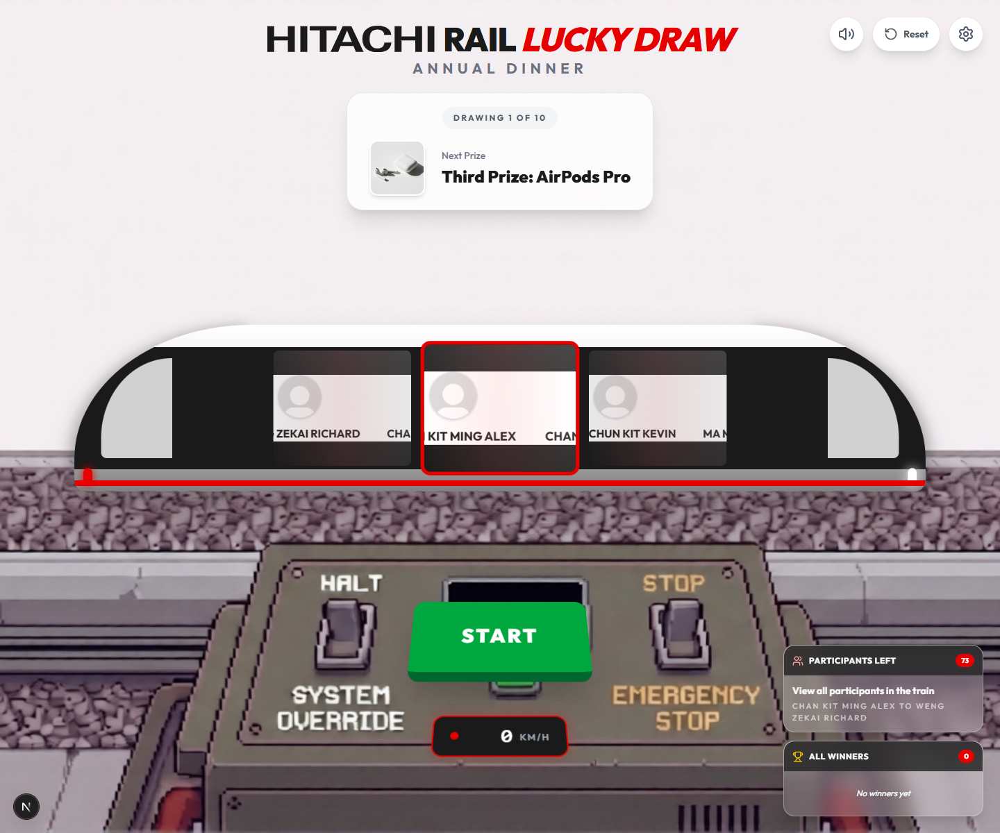
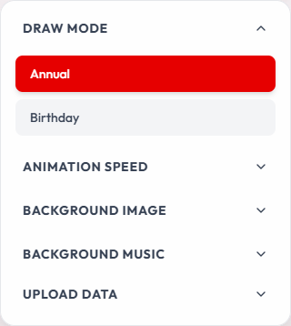
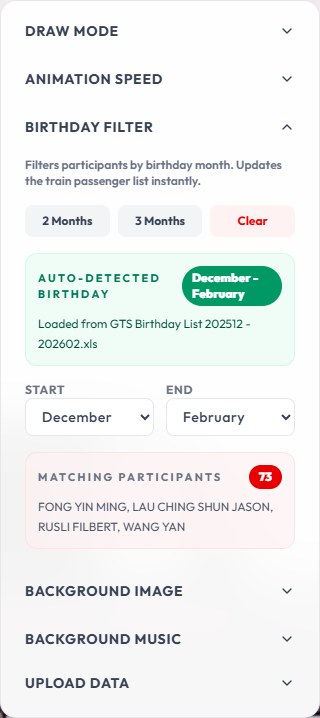
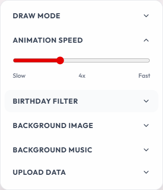
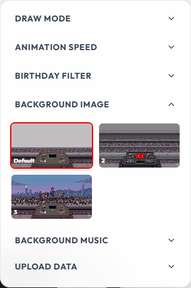
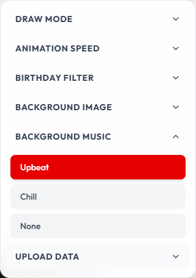
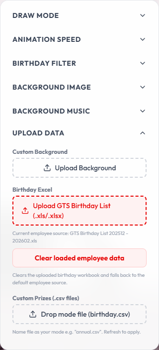
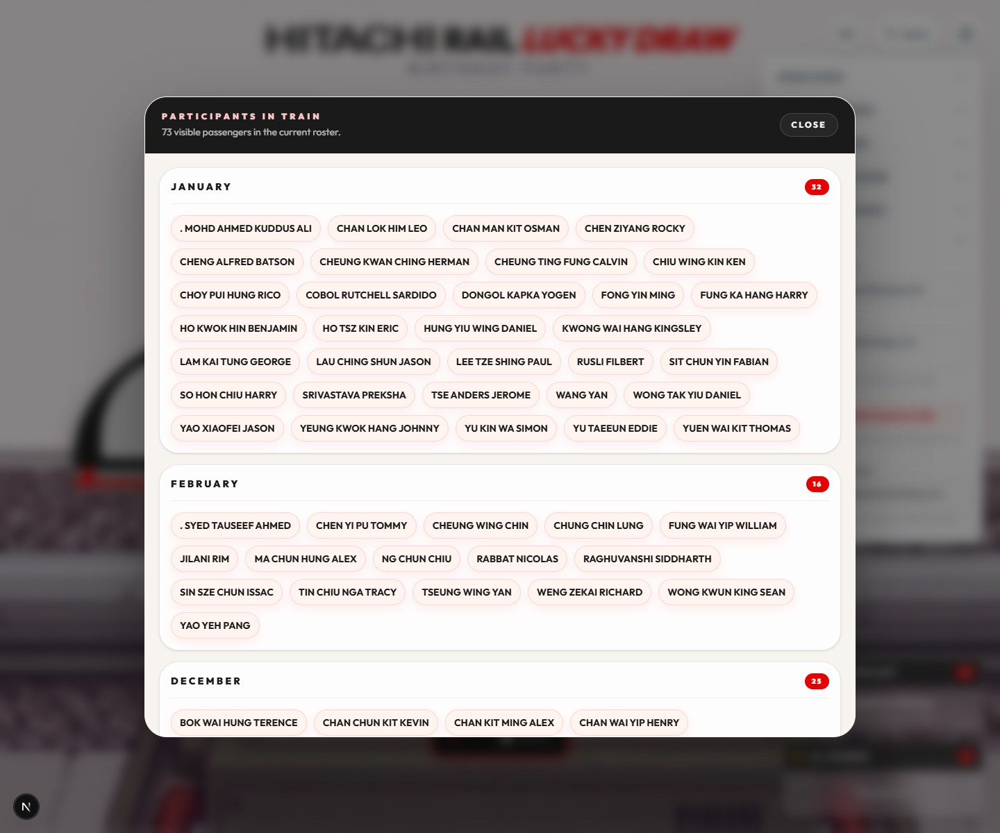
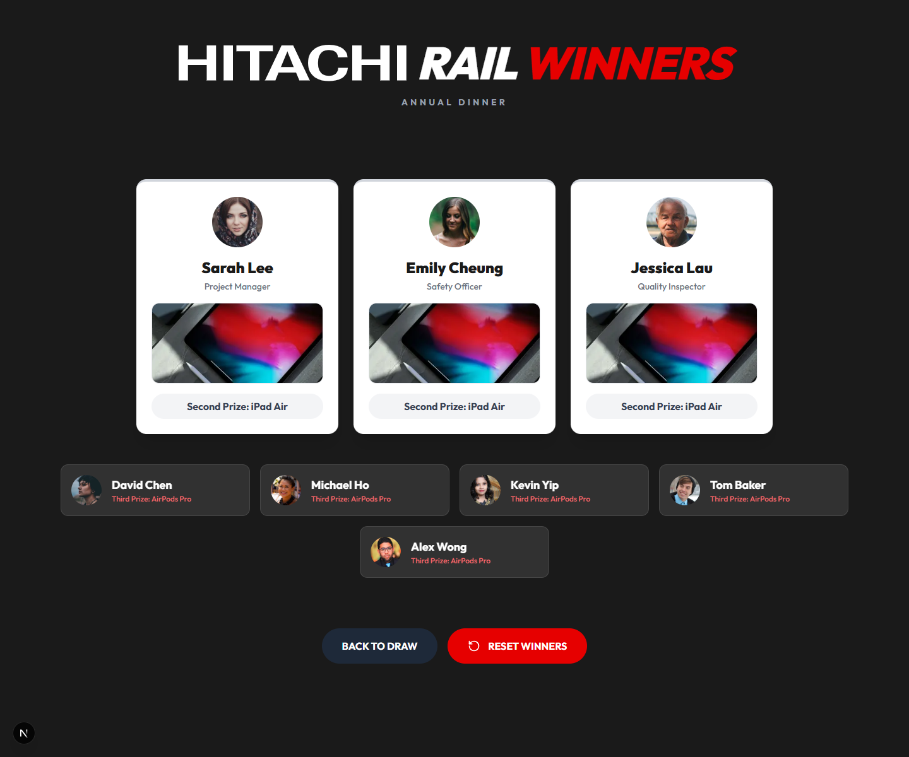
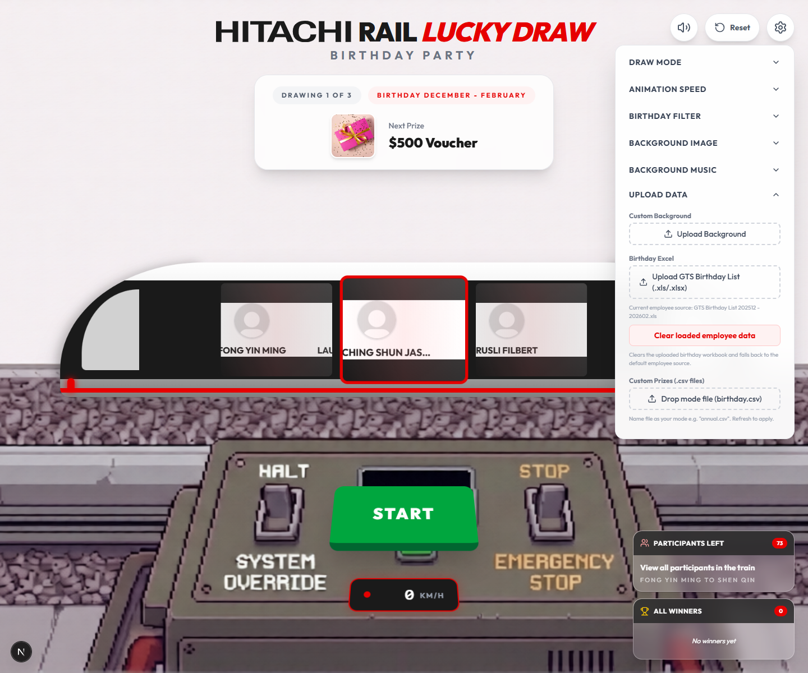

# Hitachi Rail Lucky Draw

Hitachi Rail Lucky Draw is a Next.js event draw app with a train-style rolling animation, prize-mode switching, birthday filtering, XLS workbook upload, animated winner reveal, background selection, built-in BGM options, CSV-based data management, winner persistence, and a podium summary screen for completed draws.



## What It Does

- Runs a lucky draw with a train reel animation and prize-by-prize winner selection.
- Supports multiple draw modes based on CSV files in `public/`, such as `annual.csv` and `birthday.csv`.
- Filters participants by birthday range when Birthday Party mode is active.
- Automatically detects the birthday range from an uploaded `GTS Birthday List` Excel file (`.xls` / `.xlsx`).
- Shows a full-screen animated **Golden Ticket** reveal for each winner.
- Displays a **podium summary screen** once all prizes in the event are drawn.
- Lets operators view all active participants in a panel at any time.
- Lets operators switch the background image from available files in `public/backgrounds/`.
- Lets operators choose built-in BGM tracks and adjust animation speed from the settings panel.
- Persists mode, winners, mute state, birthday range, background, and BGM in browser local storage.
- Supports replacing prize data, backgrounds, and birthday workbooks from the UI without touching the server.

## Requirements

- Node.js 20+ recommended
- npm

No environment variable is required for the current local lucky draw flow. The checked-in `.env.example` comes from the original template, but this app does not currently read `GEMINI_API_KEY` or `APP_URL` during normal operation.

## Install And Run

1. Install dependencies.

```bash
npm install
```

2. Start the development server.

```bash
npm run dev
```

3. Open the app.

```text
http://localhost:3000
```

### Production Commands

```bash
npm run build
npm start
```

## Main Features

### 1. Train draw screen

The main screen shows the active mode, the next prize, the number of participants left, the winner list so far, and the main `START` / `STOP` controls.

- `START` begins the rolling animation and accelerates the reel.
- `STOP` decelerates and lands on a random eligible participant.
- `Reset` clears drawn winners for the current event.
- The speaker button mutes or unmutes all audio.

### 2. Draw mode switching

Modes are created from CSV files in `public/`. For example:

- `annual.csv` becomes the Annual Dinner mode
- `birthday.csv` becomes the Birthday Party mode
- any other file name becomes another mode

Open the settings panel from the top-right corner, then use `Draw Mode` to switch between available prize sets.



Important behavior:

- Switching mode clears the current winners list for the event.
- Background, mute state, BGM, and birthday month settings remain saved.

### 3. Birthday Party mode

When `birthday` mode is selected, the app filters participants using the active birthday source.

- If you upload a `GTS Birthday List *.xls` or `*.xlsx` file from the UI, that workbook becomes the active birthday source and its start and end month range is auto-applied.
- If no uploaded workbook has been explicitly activated, the app reads the checked-in `GTS Birthday List` files in `public/data/`.
- If `public/data/` does not contain a birthday Excel file, the app falls back to the `birthday` column from `employees.csv`.

You can adjust the birthday range in the settings panel:

- Quick presets: `2 Months` and `3 Months`
- Manual month range: `Start` and `End`
- `Clear` resets the filter to January through December

The panel also shows:

- the auto-detected Excel period when a birthday workbook is loaded
- how many employees match the selected birthday range
- a short preview of matching names



Birthday parsing notes:

- Recommended format: `YYYY-MM-DD`
- The filtering logic also tolerates values where the month and day can still be parsed correctly
- Employees with invalid or missing birthday values are excluded from birthday filtering

### 4. Animation speed control

Use the `Animation Speed` section in settings to tune how fast the train reel spins.



- Drag the slider between `Slow` (2×) and `Fast` (8×).
- The current multiplier is shown in the centre of the slider.
- Your chosen speed is applied immediately to the next draw.

### 5. Background selection

Use the `Background Image` section in settings to switch the train backdrop.



How it works:

- The app scans `public/backgrounds/` for `.png`, `.jpg`, `.jpeg`, and `.webp` files.
- It also recognizes root-level `public/background*.png|jpg|jpeg|webp` files.
- Your selected background is saved in local storage and restored on the next visit.

### 6. Background music

Use the `Background Music` section in settings to switch between the built-in tracks.



Current UI options:

- `Upbeat`
- `Chill`
- `None`

Notes:

- BGM pauses while the draw is running and resumes afterward.
- Browsers may require one user click before background music can start.
- There is no custom BGM upload button in the current UI. To add another BGM choice, place the audio file in `public/` and extend the `bgmOptions` list in `app/page.tsx`.

### 7. XLS birthday workbook upload and CSV uploads

Use the `Upload Data` section in settings to replace event data directly from the browser — no server restart needed.



Available uploads:

| Upload button | What it does |
| --- | --- |
| `Upload Background` | Saves a custom image into `public/backgrounds/` and makes it selectable immediately |
| `Upload GTS Birthday List (.xls/.xlsx)` | Parses the workbook, stores it outside `public/`, sets it as the active birthday source, and auto-updates the birthday month range |
| `Clear loaded employee data` | Removes the uploaded birthday workbook and falls back to the default checked-in employee source |
| `Drop mode file (birthday.csv)` | Uploads any prize-mode CSV into `public/`, creating or replacing a draw mode |

**XLS upload details:**

- The file must follow the standard `GTS Birthday List` sheet layout (see `lib/excel-birthday-adapter.ts` for the expected header row structure).
- After upload the server validates that at least one employee row was parsed successfully; invalid files are rejected with an error.
- The detected month range (read from the workbook filename or header) is surfaced in the Birthday Filter section as the `Auto-Detected Birthday` badge.
- Only one uploaded workbook is kept active at a time. Uploading a new file replaces the previous one.

Notes:

- Uploading triggers a page reload so the latest files are picked up.
- Mode names come from the CSV filename without the `.csv` extension.

### 8. Participants panel

Click the `Participants Left` card on the main screen to open the full participants list.



- In Birthday Party mode the list is grouped by birth month.
- In all other modes participants are listed in their natural CSV order.
- The count badge updates in real time as winners are drawn.

### 9. Winner reveal — Golden Ticket

After `STOP` lands on a participant, the app transitions to the full-screen **Golden Ticket** reveal.


The reveal screen shows:

- The winner's photo, name, job title, and staff code (if available)
- The prize name and prize image on the ticket stub
- A confetti burst and celebration sound

From this screen operators can:

- `REDRAW` — discard the current winner and draw again without consuming a prize slot
- `NEXT DRAW` — accept the winner and return to the train for the next prize
- `VIEW ALL WINNERS` — jump directly to the summary screen (appears when all prizes are drawn)

### 10. Summary screen

Once every prize in the active mode has been drawn, the app transitions to the summary podium.



The summary screen displays all winners grouped by prize tier. Operators can return to the train screen with `Reset` to run the event again.

## Prepare Employee Data

The employee file must be named `employees.csv`.

### Required columns

| Column | Required | Description |
| --- | --- | --- |
| `id` | Recommended | Unique identifier for each employee |
| `name` | Yes | Employee display name |
| `title` | Recommended | Job title or department label |
| `avatar` | Optional | Public image URL |
| `birthday` | Required for birthday mode | Birthday used for Birthday Party filtering |

### Recommended example

```csv
id,name,title,avatar,birthday
1,Alex Wong,Senior Engineer,https://i.pravatar.cc/150?u=alex,1990-01-14
2,Sarah Lee,Project Manager,https://i.pravatar.cc/150?u=sarah,1988-02-22
3,David Chen,Technician,https://i.pravatar.cc/150?u=david,1992-03-09
```

### Employee data tips

- Use stable `id` values so winner persistence remains predictable.
- Keep avatar URLs publicly accessible.
- Use valid dates if you plan to use Birthday Party mode.
- If `avatar` is empty, the UI falls back to a placeholder profile.

## Prepare Prize Mode Data

Each non-employee CSV file in `public/` becomes one draw mode.

Examples:

- `annual.csv`
- `birthday.csv`
- `family_day.csv`
- `staff_awards.csv`

### Required columns

| Column | Required | Description |
| --- | --- | --- |
| `id` | Recommended | Prize identifier |
| `name` | Yes | Prize name shown in the UI |
| `image` | Optional | Prize image URL |
| `quantity` | Yes | Number of winners for this prize row |

### Recommended example

```csv
id,name,image,quantity
1,Third Prize: AirPods Pro,https://images.unsplash.com/photo-1600294037681-c80b4cb5b434?w=400&h=400&fit=crop,5
2,Second Prize: iPad Air,https://images.unsplash.com/photo-1544244015-0df4b3ffc6b0?w=400&h=400&fit=crop,3
3,Grand Prize: iPhone 15,https://images.unsplash.com/photo-1695048133142-1a20484d2569?w=400&h=400&fit=crop,1
```

### Prize mode tips

- `quantity` expands a row into repeated prizes internally.
- If `quantity` is missing or invalid, the app treats it as `1`.
- The draw is complete when all prize entries in the active mode have been used.
- If no eligible employees remain, the main button changes to `NO PASSENGERS`.

## Default Data Files

The repository already includes starter data under `public/`:

- `employees.csv`
- `annual.csv`
- `birthday.csv`
- `upbeat.mp3`
- `chill.mp3`
- `backgrounds/`

These files are enough to run the app immediately after `npm install`.

## Typical Operator Flow

1. Start the app with `npm run dev`.
2. Open `http://localhost:3000`.
3. Open settings and choose the draw mode.
4. If using Birthday Party mode, upload the latest `GTS Birthday List` workbook or set the birthday month range manually.
5. Change the background and BGM if needed.
6. Upload a fresh birthday workbook or event prize CSV if the event data changed.
7. Run the draw with `START` and `STOP`.
8. Accept or redraw from the Golden Ticket reveal screen.
9. Use `VIEW ALL WINNERS` after the final prize is drawn to see the full podium.



## Persistence And Reset Behavior

The app stores these values in browser local storage:

- selected mode
- selected background
- selected BGM
- mute state
- birthday month range
- winner history

`Reset` clears the winner history for the current event, but it does not reset your saved background, mode, mute state, or BGM choice.

## Regenerate README Screenshots

The screenshots in this README were generated with Playwright and saved into `public/docs/`.

If the UI changes, regenerate them with:

```bash
npm run docs:screenshots
```

Make sure the app is already running at `http://localhost:3000` before executing the screenshot command.

## Relevant Files

- `app/page.tsx`: main lucky draw UI and client-side behavior
- `app/api/data/route.ts`: reads CSV data and backgrounds from `public/`
- `app/api/upload/route.ts`: handles file uploads into `public/`
- `lib/excel-birthday-adapter.ts`: parses `GTS Birthday List` XLS/XLSX workbooks
- `lib/birthday-upload-store.ts`: manages uploaded birthday workbook persistence
- `public/employees.csv`: participant source data
- `public/annual.csv`: sample Annual Dinner prizes
- `public/birthday.csv`: sample Birthday Party prizes
- `scripts/capture-readme-screenshots.mjs`: Playwright screenshot generator for the README
